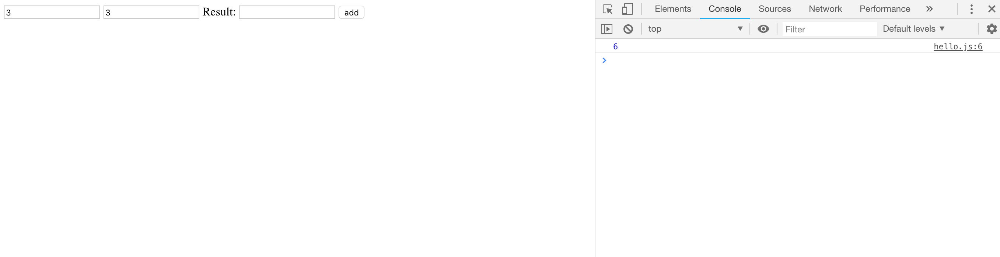

[Back to main page](https://ereeq.github.io/proglangblog/)

#Syntaxing

I learned that I really dislike web development and I will never pursue a job in web development. It is very annoying and it is not fun.

So all TypeScript functions are just `function` and any variables are declared by `let`. so like a `let number = 1` will declare `number` variable as 1.

and then to use it, it uses a `document.body.innerHTML`. I dont understand how it works but it seems like the dots are just like java.

I think that's all i need for now, I wont be touching classes, interfaces and inheritance.

to move html elements to typescript, we use
````typescript
document.getElementByID
````

Currently it shows like this:

where the answers show up on the console.
